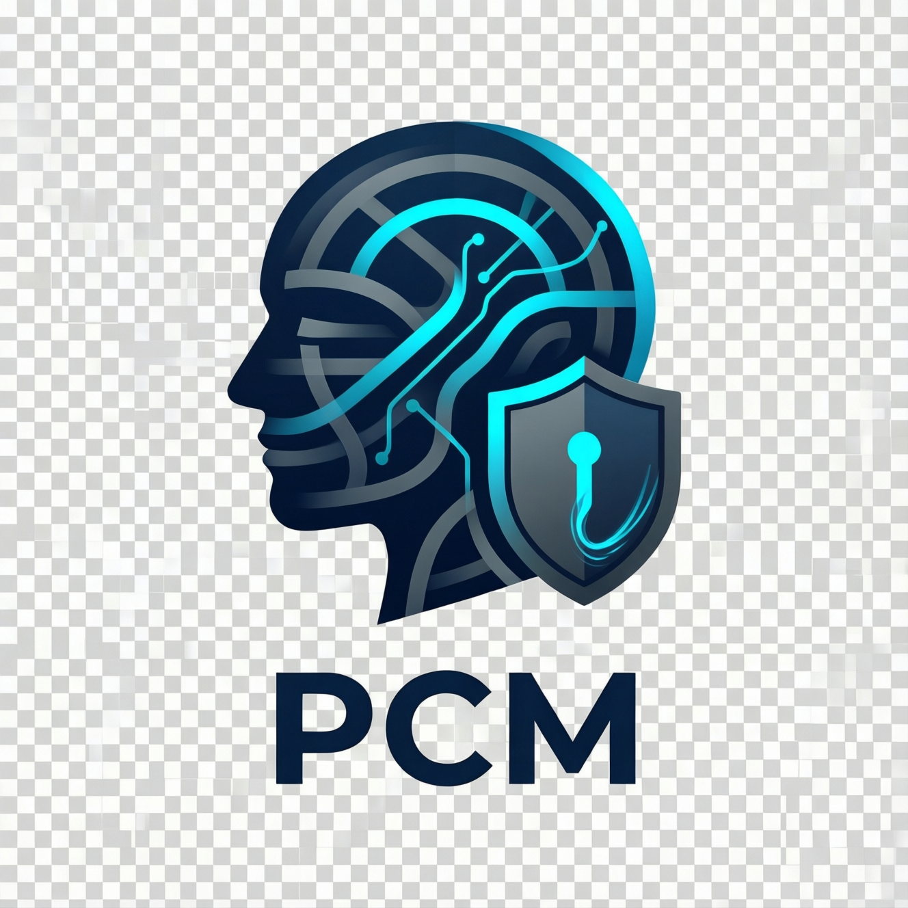

<p align="center">
  
</p>

# PCM - Profile & Consent Manager

> **A privacy-first, open-source identity & GDPR consent platform**

[](LICENSE)
[](https://openjdk.org/projects/jdk/21/)
[](https://spring.io/projects/spring-boot)
[](https://github.com/vibe-afrika/pcm/actions/workflows/ci-cd.yml)
[](SECURITY.md)

---

## 🚀 Quick Start

```bash
# Clone the repository
git clone https://github.com/Sympol/pcm.git
cd pcm

# Start infrastructure (PostgreSQL, Redis, Kafka, Vault)
docker-compose up -d

# Build all modules
mvn clean install -DskipTests

# Run the application
mvn spring-boot:run -pl pcm-infrastructure-spring
```

Refer to the [**Quick Start Guide**](docs/QUICKSTART.md) for detailed onboarding.

---

## 📖 Overview

**PCM** is a modular monolith that serves as the **single source of truth** for user profiles and GDPR-compliant consent management. It is built around four bounded contexts — Profile, Consent, Preference, and Segment — each with a pure domain layer that is completely free of framework dependencies.

- ✅ **Open source** (Apache 2.0)
- ✅ **Privacy-by-design** — immutable consent ledger, cryptographic erasure, AES-256-GCM PII encryption
- ✅ **Framework-agnostic domain** — domain and application layers have zero Spring/JPA dependencies
- ✅ **Cloud-native** — Kubernetes-ready, OpenTelemetry-native, stateless
- ✅ **Infrastructure portable** — PostgreSQL/MySQL, Kafka/RabbitMQ, AWS/Azure/GCP KMS
- ✅ **GDPR-compliant** — consent ledger, right to erasure, audit trail, blind indexing for encrypted search

---

## 📜 The Genesis: From Complexity to Clarity

PCM did not come from nowhere. It emerged from a concrete challenge within a social project for a startup.

### 1. The Initial Candidate: Apache Unomi
We initially chose [Apache Unomi](https://unomi.apache.org/) as our Customer Data Platform (CDP). It offered a comprehensive suite for profile tracking and real-time segmentation.

### 2. The Limits of Heavy Machinery
As our requirements for **Data Sovereignty** and **Extreme Security** grew, we encountered significant friction:
- **Operational Complexity**: The Apache Karaf/OSGi architecture added heavy overhead and a steep learning curve for our team.
- **Security-by-Design**: We needed native, transparent PII encryption (via HashiCorp Vault) as a foundational layer, which was difficult to "bolt on" to an existing engine.
- **Infrastructure Overhead**: A mandatory Elasticsearch dependency for all profile operations was overkill for our primary identity management needs.

### 3. The Pivot to PCM
We decided to build a platform focused on the core: **Identity, Consent, and Protection**. By leveraging **Spring Boot 3**, **Clean/Hexagonal Architecture**, and **HashiCorp Vault**, we created a lean, high-performance alternative that prioritizes the **security of citizens' data** above all else.

Today, PCM is open-sourced to empower other developers facing similar challenges in building privacy-first applications.

---

## 🧩 Architecture

PCM is a **modular monolith** using **Hexagonal Architecture** with four bounded contexts deployed as a single Spring Boot application:

| Bounded Context | Responsibility | Key Entities |
|-----------------|----------------|--------------|
| **Profile** | User identity, handle management, dynamic attributes | `Profile`, `ProfileId`, `Handle` |
| **Consent** | GDPR consent collection, immutable ledger, legal proof | `Consent`, `ConsentEvent`, `ConsentPurpose` |
| **Segment** | User classification and real-time segmentation | `Segment`, `SegmentCriteria` |
| **Preference** | UX preferences (language, theme, notifications) | `Preference`, `PreferenceKey` |

### Module Structure

```
pcm/
├── pcm-domain/                      # Shared domain concepts (encryption interfaces)
├── preference-context/
│   ├── preference-domain/           # Pure Java — zero framework deps
│   ├── preference-application/      # Use cases — pure Java
│   └── preference-infrastructure/   # JPA entities, Spring Data adapters
├── profile-context/
│   ├── profile-domain/
│   ├── profile-application/
│   └── profile-infrastructure/
├── consent-context/
│   ├── consent-domain/
│   ├── consent-application/
│   └── consent-infrastructure/
├── segment-context/
│   ├── segment-domain/
│   ├── segment-application/
│   └── segment-infrastructure/
├── pcm-infrastructure-spring/       # Unified Spring Boot application
│   ├── web/                         # REST controllers
│   ├── config/                      # Spring configuration & DI wiring
│   ├── encryption/                  # AES-256-GCM, KMS adapters, key management
│   └── PcmApplication.java
├── charts/                          # Helm charts for Kubernetes
├── docs/                            # ADRs, guides, API reference
└── docker-compose.yml               # Local development environment
```

### Communication

- **Inter-context**: Internal Spring event bus (`ApplicationEventPublisher`) — synchronous, transactional, no network calls
- **Observability**: **OpenTelemetry** native (traces & metrics exporters)
- **Security**: JWT / OAuth2 resource server, mTLS between services, Keycloak for IAM

### PII Encryption

All sensitive fields are encrypted at rest using **AES-256-GCM** with envelope encryption (DEK/KEK pattern). Keys are managed via HashiCorp Vault, AWS KMS, Azure Key Vault, or GCP Cloud KMS. See [PII Encryption Architecture](docs/architecture/pii-encryption.md) for details.

---

## ⚙️ Configuration

PCM uses environment variables for all configuration. No mandatory Config Server.

Key settings:

| Variable | Description | Default |
|----------|-------------|---------|
| `SPRING_DATASOURCE_URL` | Database connection URL | `jdbc:postgresql://localhost:5432/pcm_db` |
| `PCM_ENCRYPTION_PROVIDER` | KMS provider (`vault`, `aws`, `azure`, `gcp`, `local`) | `local` |
| `PCM_ENCRYPTION_KEY` | Master key (local mode only) | — |
| `VAULT_URI` | HashiCorp Vault address | `http://localhost:8200` |

See [Infrastructure Portability](docs/PORTABILITY.md) for the full configuration reference.

---

## 📚 Documentation

- [**Quick Start Guide**](docs/QUICKSTART.md) — Get PCM running locally in 5 minutes
- [**API Reference**](docs/API_REFERENCE.md) — Endpoints, payloads, and examples
- [**Framework Adapter Guide**](docs/developer-guide/framework-adapter-guide.md) — How to add a Quarkus or Micronaut adapter
- [**PII Encryption Architecture**](docs/architecture/pii-encryption.md) — AES-256-GCM, envelope encryption, blind indexing
- [**Dependency Monitoring**](docs/DEPENDENCY_MONITORING.md) — Monitoring updates and vulnerabilities
- [**Architecture Decision Records**](docs/architecture/) — Design decisions and rationale

---

## 🔌 Ecosystem

PCM core is intentionally focused on **generic GDPR consent management**. After careful consideration, we decided to move IAB TCF support out of the core platform entirely.

### Why TCF was removed from PCM core

The IAB Transparency & Consent Framework is an advertising-industry standard designed to legitimize large-scale tracking. This is fundamentally at odds with PCM's privacy-first mission. The Belgian Data Protection Authority (APD) ruled in 2022 that TCF does not satisfy GDPR requirements as designed. Keeping TCF in the core would send a contradictory signal about what PCM stands for.

The decision was not taken lightly — TCF support was initially built and tested as part of the consent context. After reflection, we concluded that the right architecture is a clean separation: PCM core handles generic GDPR consent, and TCF is an opt-in external module for organizations that specifically need it.

See [ADR-004](docs/architecture/adr-004-tcf-removal.md) for the full rationale and implementation details.

### External modules

- **pcm-tcf-adapter** *(coming soon — deployed independently)*: IAB TCF 2.x support for organizations that need advertising consent management. Deployed as a standalone service that calls PCM's consent API to translate TC Strings into generic consent operations. It has no impact on PCM core and can be adopted without modifying the platform.

---

## 📝 Notes

> [!NOTE]
> The logo was generated using the following prompt:
> A modern, high-tech logo for an open-source platform named 'PCM' (Profile & Consent Manager). The design should feature a stylized digital profile head and a shield or padlock to represent privacy and consent. Use a professional color palette like deep blue, vibrant cyan, and slate grey. The aesthetic should be clean, minimalist, and premium, suitable for a GitHub header. No text other than 'PCM'. White background or transparent-like aesthetic.

